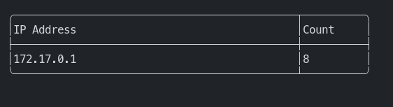

# ebpf-xdp

* This repo contains code to build a tool to examine IP address a host is connecting to.
Here [eBPF](https://ebpf.io/) is used to write a program in kernel space using [XDP](https://docs.cilium.io/en/stable/concepts/ebpf/intro/) to examine the packets and extract the IP address.

* Since XDP is the earliest point where the packets can be intercepted it was very interesting to experiment with and learn.

* Used Golang to write the userspace program to display the IP address with the count of packets.

* Used [Cilium eBPF](https://github.com/cilium/ebpf) to write the userspace Go code. There is a very handy tool [bpf2go](github.com/cilium/ebpf/cmd/bpf2go) which can be used to generate the Go code from the eBPF code.

* Used [Bubble-Table](https://github.com/Evertras/bubble-table) which is based on the [BubbleTea](https://github.com/charmbracelet/bubbletea) framework to product the TUI

## Development

Pre-requisites:

* Host OS with Docker installed
* Currently cannot be run on Docker for Mac

```bash
make docker-run
```

This will open up a shell with the Docker container that has all the dependencies installed

```bash
make build

# on amd64 machine (use ebpf-xdp-arm64 if you are on arm64)
./bin/ebpf-xdp <iface_name>
# ./bin/ebpf-xdp eth0
```

Example Output:



XDP Kernel program can be found [here](./ebpf/xdp.c)

## TODOs

* Add support for IPv6 addresses
